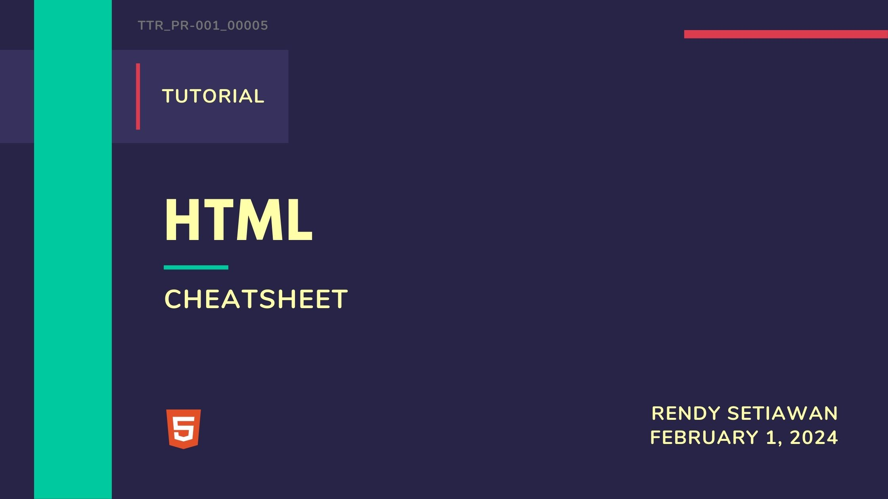

<!--[Banner]-->
<kbd>
  
</kbd>

TTR_PR-001_00005

# HTML - cheatsheet

## Table of Contents
- [Document Outline](#document-outline)
- [Page Information](#page-information)
- [Document Structure](#document-structure)
- [Links](#links)
- [Text Markup](#text-markup)
- [List](#list)
- [Images](#images)
- [Comments](#comments)
- [Form](#form)
- [Objects](#objects)
- [Tables](#tables)
- [Common Character and Entities](#common-character-and-entities)

## Document Outline
`<DOCTYPE>` → Version of (X)HTML

`<html>` → HTML Document

`<head>` → Page Information

`<body>` → Page contents

## Page Information
`<title>` → Title

`<style>` → Style resources

`<script>` → Script resources

`<link />` → Relevant resources

`<base />` → Base URL

`<meta />` → Meta data

## Document Structure
`<h(1-6)>` → Heading (1–6)

`
` → Page section

`` → Inline Section

`
` → Paragraph

` ` → Line break

`
` → Horizontal rule

## Links
`<a href="">` → Page link

`<a href="mailto:">` → E-Mail link

`<a name="name">` → Anchor

`<a href="#name">` → Link to anchor

## Text Markup
`<strong>` → Strong emphasis

`<em>` → Emphasis

`<blockquote>` → Long quotation

`<q>` → Short quotation

`<abbr>` → Abbreviation

`<acronym>` → Acronym

`<address>` → Address

`<pre>` → Pre-formated text

`<dfn>` → Definition

`<code>` → Code

`<cite>` → Citation

`<del>` → Deleted text

`<ins>` → Inserted text

`` → Subscript

`` → Superscript

`<bdo>` → Text direction

## List
`<ol>` → Ordered list

`<ul>` → Unordered list

`<li>` → List item

`<dl>` → Definition list

`<dt>` → Definition term

`<dd>` → Term description

## Images
`` → Image

`<map>` → Image map

`<area />` → Area of image map

## Comments
<!--comment text --> Comment text

## Form
`<form>` → Form

`<fieldset>` → Collection of fields

`<legend>` → Form legend

`<label>` : → Input label

`<input />` → Form input

`<select>` → Drop-down box

`<optgroup>` → Group of options

`<option>` → Drop-down options

`<textarea>` → Large text input

`<button>` → Button

## Objects
`<object>` → Object

`<param />` → Parameter

## Tables
`<table>` → Table

`<caption>` → Caption

`<thead>` → Table header

`<tbody>` → Tabel body

`<tfoot>` → Table footer

`<colgroup>` → Column group

`<col />` → Column

`<tr>` → Table row

`<th>` → Header cell

`<td>` → Table cell

## Common Character and Entities
`&#34` → `"` Quotational mark

`&#38` → `&` Ampersand

`&#60` → `<` Less than

`&#62` → `>` Greater than

`&#64` → `@` "At" symbol

`&#128` → `∙` Small bullet

`&#149` → ` ` &nbsp;&nbsp;&nbsp;Non-breaking space

`&#153` → `€` Euro

`&#160` → `™️` Trademark

`&#163` → `￡` Pound

`&#169` → `©` Copyright symbol

---

**#HTML #Cheatsheet #Tutorial #WebDev**

[🔼 Back To Top](#html---cheatsheet)